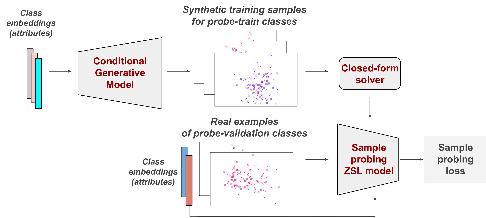
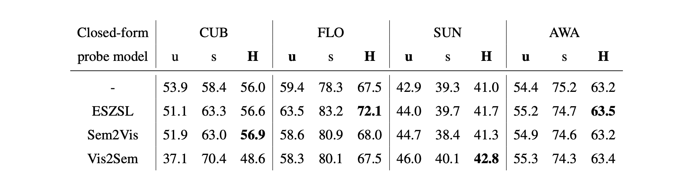

## Closed-form Sample Probing for Learning Generative Models in Zero-shot Learning

The official repository for the [Closed-form Sample Probing for Learning Generative Models in Zero-shot Learning](https://openreview.net/forum?id=ljxWpdBl4V) paper published at ICLR 2022.


<p align="center">  </p>
<p align="justify"> <b>Figure</b>: Illustration of the proposed framework for the end-to-end sample probing of conditional generative models. At each training iteration, we take synthetic training examples for some subset of seen classes (probe-train classes) from the conditional generative models, train a closed-form solvable zero-shot learning model (sample probing ZSL model) over them and evaluate it on the real examples of a different subset of seen classes (probe-validation classes). The resulting cross-entropy loss of the probing model is used as a loss term for the generative model update.
</p>


## Data
Proposed data splits for all datasets (all together with the finetuned features) can be found [here](https://drive.google.com/drive/folders/1rCfyAr2dWuNN5O2kbouclaFjNIbPqeHy?usp=sharing). Please download and place data folder suchlike the directory structure after the placement should look like this:

    .
    ├── data                    # Proposed data | ### Downloaded and placed here ###
    ├── images                  # Images used in README
    ├── src                     # Source files
    ├── LICENSE
    └── README.md

**P.S.** <ins>In case of a problem of reaching data using link above</ins>, the exact same proposed splits can be found [here](https://www.mpi-inf.mpg.de/departments/computer-vision-and-machine-learning/research/zero-shot-learning/zero-shot-learning-the-good-the-bad-and-the-ugly) (not including FLO and any finetuned features) and [here](https://github.com/akshitac8/tfvaegan) (including all).

## Installation
For the installation details, please check [tfvaegan](https://github.com/akshitac8/tfvaegan) since the provided scripts (under <i>scripts</i> folder) train TF-VAEGAN model with and without sample probing. 

Training logs of <i>validation</i> and <i>test</i> phases of the presented results in the paper can be found under <i>logs</i> folder.

## Results

<p align="justify"> <b>Table</b>: Generalized zero-shot learning scores of sample probing with alternative closed-form models, based on TF-VAEGAN baseline. In terms of h-scores, we observe considerable performance variations across the probe models and datasets. These results suggest that sample probe alternatives have their advantages and disadvantages, and their performances can be data-dependent. Overall, the fact that we observe equivalent (2) or better (9) h-scores in 11 out of 12 sample probing experiments indicates the versatility of the approach in terms of compatibility with various closed-form probe models.</p>
<p align="center">  </p>

## Citation
If you find this code useful in your research, please consider citing as follows:
```
@inproceedings{
cetin2022closedform,
title={Closed-form Sample Probing for Learning Generative Models in Zero-shot Learning},
author={Samet Cetin and Orhun Bu{\u{g}}ra Baran and Ramazan Gokberk Cinbis},
booktitle={International Conference on Learning Representations},
year={2022},
url={https://openreview.net/forum?id=ljxWpdBl4V}
}
```
## Acknowledgements
The parts of the code related to generative model (TF-VAEGAN) training is taken/adapted from [tfvaegan](https://github.com/akshitac8/tfvaegan) repository.
